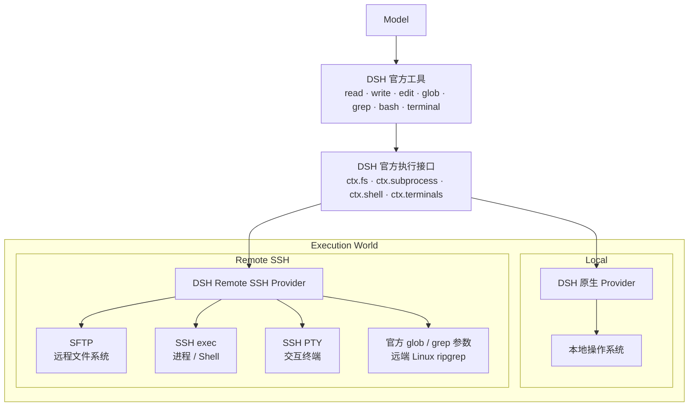

# DSH Remote SSH

[简体中文](./README.zh-CN.md) | [English](./README.md)

[](https://github.com/deepseek-ai/deepseek-harness)
[](https://github.com/NaNQiQ/deepseek-harness-remote-ssh/releases)
[](https://nodejs.org/)
[](./ARCHITECTURE.md)
[](./LICENSE)

让 **DeepSeek Harness（DSH）** 使用原生工具直接操作远程 Linux 服务器。

在对话输入框旁选择一台已添加的服务器后，DSH 原有的 `read / write / edit / glob / grep / bash / terminal` 会切换到远端执行。插件不修改 DSH 源码，服务器也无需安装 DSH、本插件、Node.js 或 Python。


## 功能

- 在 DSH 页面内添加、测试、管理和选择 SSH 服务器。
- 在本地电脑与已添加的服务器之间切换执行环境。
- 保留 DSH 官方工具，不新增能力受限的 `ssh_*` 替代工具。
- 通过 SFTP 操作文件，通过 SSH exec / Shell 执行命令，通过 SSH PTY 提供交互终端。
- 保留官方 `glob / grep`，自动处理并缓存远端 Linux 所需的 ripgrep。
- 支持 SSH Agent、私钥文件和临时密码认证。
- 首次连接核对 SSH Host Key 指纹，指纹变化时拒绝连接。
- DSH Host 维护并复用服务器连接，不会为每条消息重新登录。

## 安装

需要 Node.js 24 或更高版本，并确保 `dsh` 和 `pnpm` 可在命令行中使用。

```bat
dsh plugin --profile web add github:NaNQiQ/deepseek-harness-remote-ssh
dsh web
```

如果 Windows 提示找不到 `pnpm`，请在 CMD 中执行 `npm install -g pnpm@11`，然后重新打开 CMD。

## 使用

1. 启动 `dsh web`。
2. 打开输入框旁的执行环境选择器。
3. 选择“添加服务器”。
4. 填写连接信息、认证方式和默认工作目录。
5. 按页面引导准备认证并核对服务器指纹。
6. 点击“测试并保存”。
7. 在输入框旁选择该服务器。

以后只需选择已保存的服务器。切换后模型仍然使用 DSH 官方工具，变化的只是工具背后的执行位置。

## 界面预览

<details>
<summary><strong>添加并配置 SSH 服务器</strong></summary>


</details>

<details>
<summary><strong>在本地与远程执行环境之间切换</strong></summary>


</details>

<details>
<summary><strong>使用 DSH 原生工具操作远程服务器</strong></summary>


</details>

## 架构



```text
原生 DSH @ Linux
        ≈
DSH @ 本地电脑 + DSH Remote SSH → 同一台 Linux
```

插件只改变 **DSH 在哪里执行**，不改变 **模型如何使用 DSH 工具**。详细实现见 [ARCHITECTURE.md](./ARCHITECTURE.md)。

## 认证

| 方式 | 说明 |
| --- | --- |
| SSH Agent | 插件只请求 Agent 签名，不读取私钥正文，也不启用 Agent Forwarding；适合个人桌面环境 |
| 私钥文件 | 只保存密钥路径，连接时读取文件；适合专用账号或服务端部署 |
| 临时密码 | 只保存在当前 DSH Host 进程内存，重启后需要重新输入 |

## 远端要求与安全边界

- 目标为提供 SSH / SFTP 和 POSIX Shell 的 Linux / Unix 主机。
- 每台服务器可设置默认工作目录；它是默认 `cwd`，不是路径沙箱。
- 实际访问能力等同于远端 SSH 账号权限。
- Remote Provider 不会向远端暴露 DSH Host 的本地文件系统。
- 模型 API Key、Base URL 等仍由 DSH 管理，本插件不读取或保存。

更多说明见 [SECURITY.md](./SECURITY.md)。

## 更新与卸载

```bat
dsh plugin --profile web update dsh-remote-ssh
dsh plugin --profile web remove dsh-remote-ssh
```

更新或卸载后重新启动 DSH。

## 文档

- [ARCHITECTURE.md](./ARCHITECTURE.md) — 架构与实现
- [SECURITY.md](./SECURITY.md) — 安全模型与凭据处理
- [CHANGELOG.md](./CHANGELOG.md) — 版本变更
- [CONTRIBUTING.md](./CONTRIBUTING.md) — 开发与贡献

## 相关项目

- [DeepSeek Harness](https://github.com/deepseek-ai/deepseek-harness)

## 友链

[](https://linux.do/)

## License

[MIT](./LICENSE)
